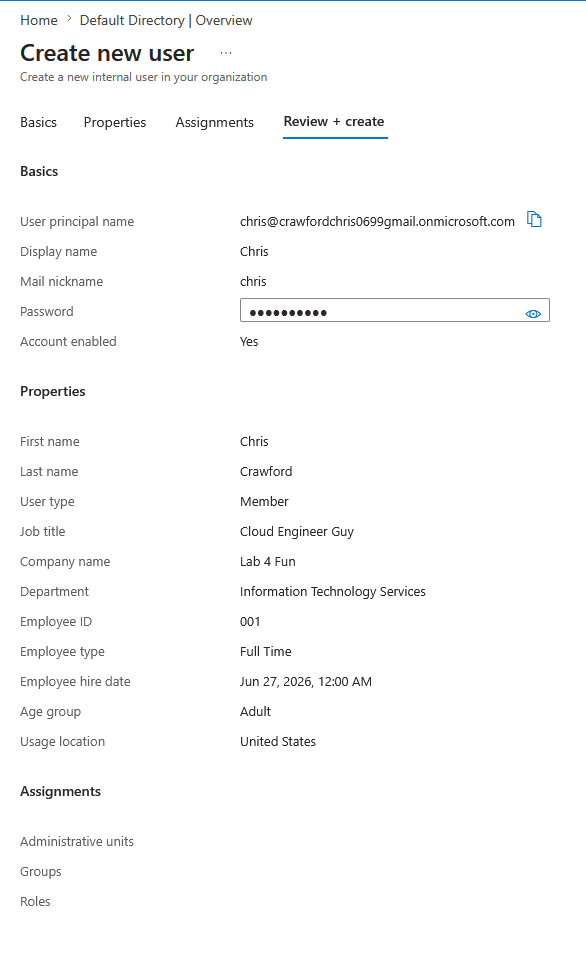
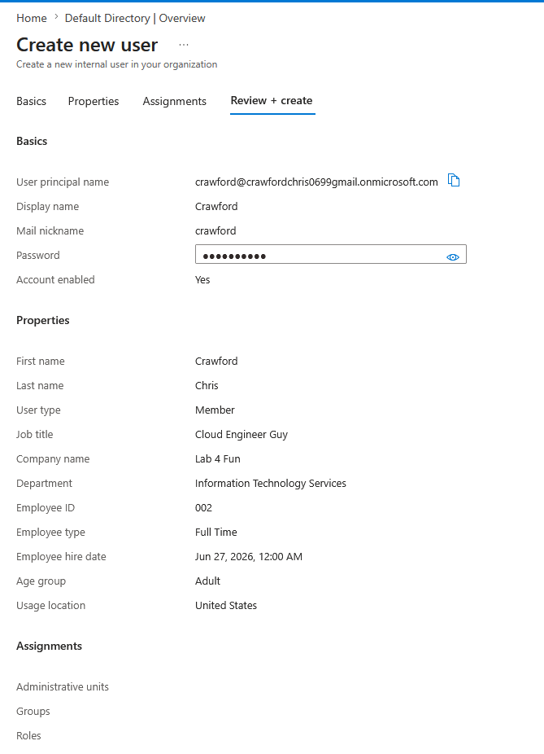
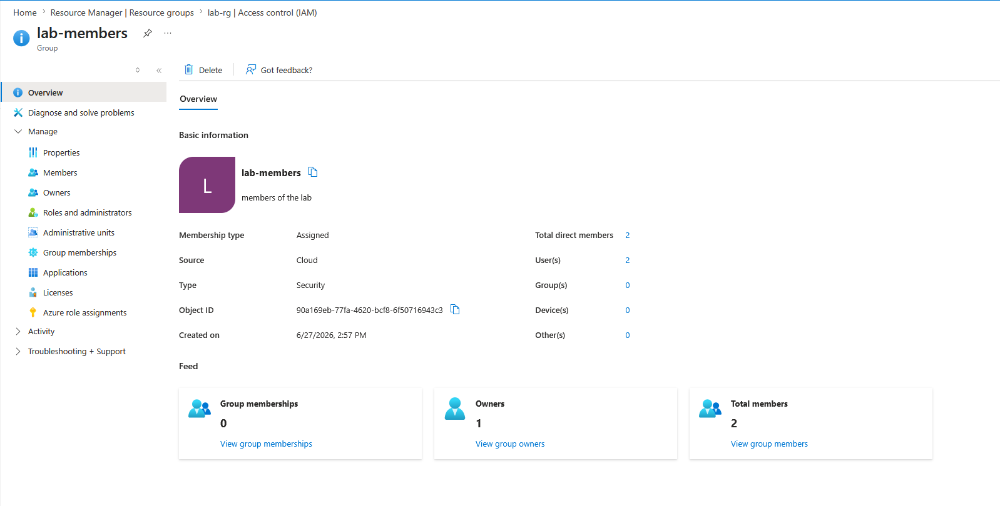
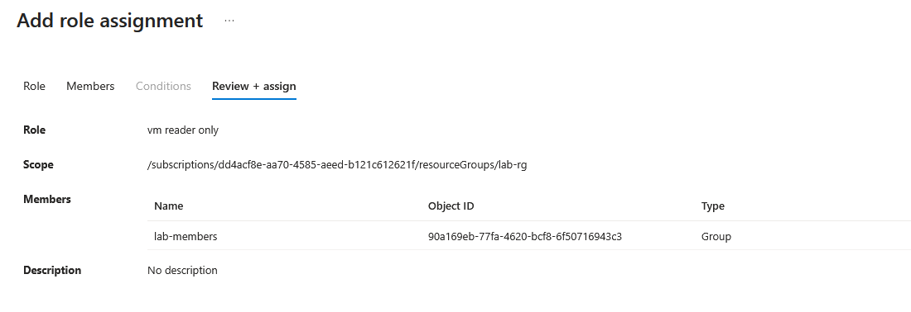
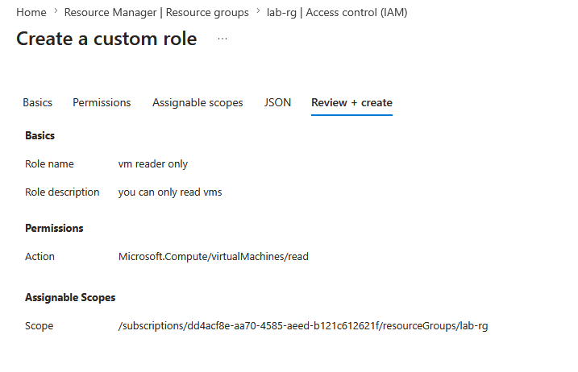
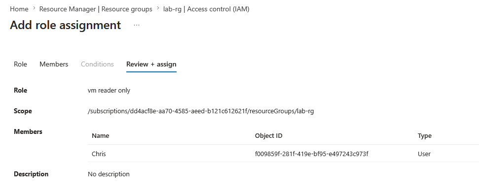

# entra ID — users, groups, and rbac

## objective
configure identity and access management in Microsoft Entra ID using built-in and custom RBAC roles following least-privilege principles.

## what was built

### users
- chris (with password Kaba139926) — assigned custom vm reader only role 
- crawford (with password Koko403049) — assigned custom role via group membership

#### screenshots

### security group
- name: lab-members
- type: security
- members: chris, crawford
- assigned: reader role scoped to lab-rg resource group

#### screenshots

### custom rbac role
- name: vm reader only
- permission: Microsoft.Compute/virtualMachines/read (only)
- assignable scope: lab-rg
- assigned to: chris, lab members group

#### screenshot

## key takeaways
custom RBAC roles enforce least-privilege per action. rather
than granting read access to all resources, vm reader only grants
access to virtual machines exclusively. azure evaluates role assignments
additively, so chris inherits both the group reader role and the
individual custom role.
