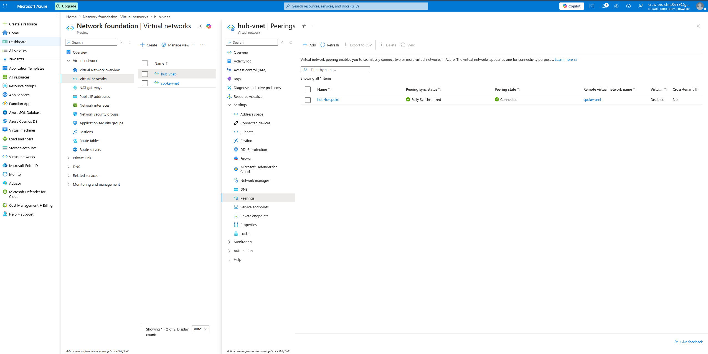
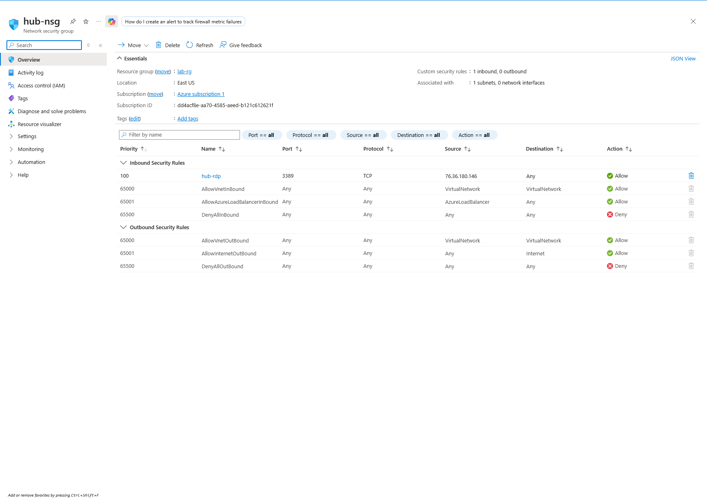
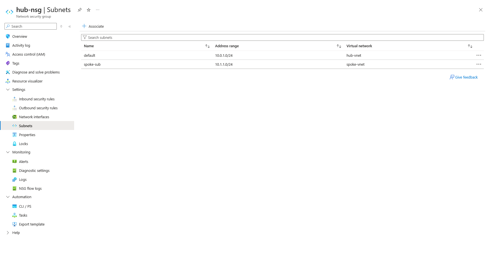

# vnet peering — hub and spoke

## main objective
build a hub-spoke topology with nsg segmentation.

## what was built
- hub-vnet: 10.0.0.0/16
- spoke-vnet: 10.1.0.0/16
- bidirectional peering, fully synchronized
- nsg on hub-subnet: RDP allowed from source IP only

## screenshot

## takeaways
- azure NSGs default deny-all at priority 65500. 
- explicit allow rule sits at priority 100.
